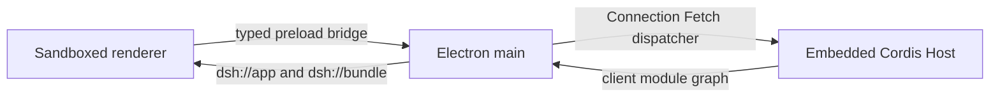

# Cookbook: wrapping DSH with Electron

English | [中文](wrapping-dsh-with-electron.zh.md)

This reference explains how to ship DSH as a native Electron application without turning Electron into a window around a `dsh web` child process. The worked implementation is [`apps/desktop`](../../apps/desktop/README.md); the [Electron embedded-Host Agent Note](../../.agents/notes/implemented/architecture/2026-08-14-electron-embedded-desktop-host.md) owns the architectural decision and rejected alternatives.

## Embed the Host; do not supervise it

Electron main already provides a Node runtime. Call `runProfile({ profile: 'desktop' })` there and let the Electron application own the Host context, native window, single-instance lock, and shutdown sequence. A child `dsh web` process would add a second dependency closure, loopback server, readiness protocol, process-tree supervision, and failure boundary without adding isolation: the renderer still needs a narrow native bridge.

The shipped desktop profile stacks `dsh-base`, `dsh-web-app`, and `dsh-desktop-app`. It retains the shared Host and client plugin graph while the desktop patch disables the HTTP server and browser-only startup rows, selects the Connection service's `electron` transport, and installs native providers. `runProfile` exposes a `prepare(ctx)` carrier seam for services that must exist before profile entries mount; it is not a reloadable configuration row.



## Reuse the Web renderer under an application origin

Use one built Web frontend for browser and desktop. Register the privileged `dsh:` scheme before `app.ready`, serve `apps/web/dist` from `dsh://app`, and serve graph-authorized client bundles from `dsh://bundle`. Return explicit MIME types for JavaScript modules, CSS, fonts, images, manifests, and JSON. Loading the production UI through `file://` gives module scripts and CSP an opaque origin and commonly leaves an empty `#root`.

The Vite build uses `base: './'` so one production build remains relocatable under both the HTTP and `dsh://app` carriers; manifest and icon links are relative for the same reason. The shared document's CSP admits the application-owned `dsh:` scripts but omits `unsafe-eval`. Vendored Loader therefore creates its `new Function` evaluator only when Host configuration interpolation actually requests it, not while the browser imports Loader.

Preload exposes only the typed `ElectronRendererBridge`. Before `AppWebEntry.run()`, the renderer awaits `desktop.manifest()` and installs the returned graph as `window.__DSH_BOOT__`; `AppWebEntry` consumes that value while releasing its Loader hold. Starting the client before the manifest lands races plugin assembly and produces an incomplete UI.

## Carry Host requests through typed IPC

Keep `contextIsolation`, renderer sandboxing, and Web security enabled, with Node integration disabled. Do not expose `ipcRenderer`, filesystem primitives, or a generic invoke method. The current bridge contains manifest lookup, Fetch open/read/cancel, session-export save, native window chrome, and supervisor status operations.

Electron main accepts Host Fetch requests only from the current main frame and only for `http://dsh.internal`. It validates method, headers, URL, and body size before calling the same Connection Fetch dispatcher used by the Web carrier. Each request gets a private `MessagePort`; main sends response metadata once, and the renderer requests one body chunk at a time. Cancellation aborts the Host request. This pull protocol bounds queued data without inventing a second RPC model.

The Electron API client always constructs Host URLs on `http://dsh.internal`. The global Fetch adapter also rewrites relative or same-document Host requests from `dsh://app`; other URLs retain Chromium's native Fetch. Without that rewrite, a client plugin calling `fetch('/api/...')` reaches the static `dsh://app` protocol handler and receives a 404.

## Support runtimes without Node's internal ESM loader

Cordis Loader normally uses Node's internal ESM loader for package import and module HMR. Electron does not expose that internal service. The public fallback resolves non-relative plugin names with `createRequire` anchored at the tree's `ctx.baseUrl`, then imports the resolved path. The anchor is load-bearing: profile-installed packages must win over application packages, and replacing it with `import(name)` resolves from the Loader package instead of the configuration owner.

Configuration watching and module hot reload have different requirements. An explicit HMR instance with `root: []` watches `cordis.patch.yml` through the filesystem only and works without Node internals. Non-empty module roots still require the internal loader and fail at startup when it is absent. Pass the profile directory as HMR `base`; otherwise a process-level `chdir()` can move the watched path.

The browser build aliases the Loader fallback's `node:module`, `node:path`, and `node:url` imports to browser stubs. Those stubs are unreachable once the client module system injects `loader.internal`; they fail loud or implement only the parsing needed for bundling. Removing the aliases makes Vite externalize Node builtins and fail the production build.

## Package a closed application graph

`electron-builder` follows `dependencies`, not workspace `peerDependencies`. The desktop package manifest therefore declares the complete workspace peer closure that `runProfile` may load, and CI runs `verify-runtime-closure` against that manifest before packaging. A source checkout can hide a missing declaration because pnpm's workspace links make the package available anyway; only a packaged smoke exposes the omission.

Electron's asar overlay has another constraint: a path is visible when resolution already enters `app.asar`, but an external `$DSH_HOME/profiles/node_modules` symlink pointing into the archive appears missing to `existsSync` and `require.resolve`. After `app.ready`, main prepends `join(app.getAppPath(), 'node_modules')` to `NODE_PATH` and calls `Module._initPaths()`. `createRequire` still starts at the profile directory, so profile-local packages and the ordinary parent walk retain precedence; the application graph is the final fallback. Do not move Loader `baseUrl` to the asar, unpack the entire JavaScript graph, or copy application packages into `$DSH_HOME`.

Keep the npm `electron` package external in the main and preload builds. Bundling Electron's CommonJS launcher into an ESM main can execute its binary-download wrapper inside the application and fail before `app.whenReady()`. `tsdown` uses `deps.neverBundle: ['electron']` for both entries.

On Windows, `process.execPath` in Electron names the application executable. The Windows ACL runner remains an ordinary JavaScript runner; its sandbox provider attaches `ELECTRON_RUN_AS_NODE=1` only to that confined child through `ConfinedArgv.environment`. Bash and PowerShell sandbox consumers must layer the runner-required environment after caller and DSH values. Setting the variable on the whole application would convert the desktop process itself into Node mode.

## Sync-sensitive core changes

The Electron application is mostly additive, but these existing DSH surfaces carry integration invariants. Preserve their reason when syncing upstream; JSON and TSConfig files cannot carry comments, so this table is their annotation owner.

| Existing surface | Required behavior | Regression if lost |
|---|---|---|
| `apps/cli/src/profile-boot.ts`; `apps/cli/package.json`; `apps/cli/tsconfig.json` | Export `runProfile`, run carrier `prepare` before entries, mount config-only HMR with the profile base, and keep the desktop bundle project reference plus the independently built/exported entry. | Electron cannot install native providers before consumers, user patch watching resolves against the process cwd, or the packaged entry loses its compiler dependency. |
| `packages/boot/app-boot/src/profile.ts` | Ship the `desktop` template as base + Web client roster + desktop patch. | A fresh `$DSH_HOME` cannot initialize the desktop profile. |
| `apps/web/index.html`; `apps/web/src/main.ts`; `apps/web/vite.config.ts`; `apps/web/src/node-module-stub.ts`; `apps/web/package.json`; `apps/web/tsconfig.json` | Keep relocatable production assets, the strict CSP, preload-manifest seeding, Loader builtin aliases, the client-connection dependency, the desktop e2e Host program, and Connection's client compiler reference. | One frontend build no longer serves both carriers, Vite fails on Node builtins, the client graph races its manifest, or static programs omit the renderer/desktop integration. |
| `packages/client/connection` source, manifests, and compiler faces | Keep the physical `web | electron` carrier split, shared Fetch dispatcher, typed bridge exports, URL rewrite, pull-stream implementation, and client/Host compiler entries. | Electron falls back to HTTP/WebSocket, carrier trust rules collapse into Web `trustedHosts`, or published files omit bridge code. |
| `vendor/loader/src/config/tree.ts`; `vendor/loader/src/config/utils.ts` | Keep configuration-anchored public resolution and lazy JavaScript evaluator construction. Reapply the corresponding entries in [`vendor/README.md`](../../vendor/README.md) after a vendor sync. | Packaged plugins resolve from the wrong owner, or CSP blocks the renderer at module import. |
| `vendor/hmr/src/index.ts` | Keep config-only `root: []` independent from module-loader internals; retain the guard for non-empty module roots. Reapply the local-modification log entry after sync. | Electron boot fails with `--expose-internals`, or module HMR runs without required cache data. |
| `packages/sandbox/sandbox`, `packages/sandbox/sandbox-local`, `packages/shell/*-local`, `packages/shell/*-sandbox` | Preserve `ConfinedArgv.environment` and layer it through foreground and background spawns. | Windows launches the Electron GUI instead of the ACL runner under Node mode. |
| `packages/client/modules/src/index.ts` | Keep client-graph composition independent from optional Web publication; Electron reads `graph()` and `clientPath()` through `dsh://bundle`. | Disabling `webServer` leaves the registry pending or removes the graph the renderer boot manifest needs. |
| `packages/client/ui-layout`, `packages/client/ui-sidebar`, `packages/session-query/session-log-export` | Preserve the macOS hidden-inset drag region and traffic-light spacing, plus the preload-owned native save path for session exports. | The frameless window cannot be dragged, chrome covers the sidebar, or `dsh://app` exports do nothing. |
| `packages/fs/tool-fs-search/src/search-core.ts` | Keep `DSH_RIPGREP_PATH` as an optional validated deployment override, not a required Electron boot path; the current desktop package exposes ripgrep with `asarUnpack`. | An unusable override silently falls back, or future packaging mistakes the unused override for the current binary path. |
| Root `package.json`, `pnpm-workspace.yaml`, `tsconfig.host.json`, and desktop-aware `scripts/*` | Keep the desktop dev entry, private build-only exclusions, Electron install policy, compiler coverage, release cleanup, dependency-closure scan, and generated catalog inputs. | Desktop is accidentally published to npm, omitted from static gates, or packaged from a stale/unverified graph. |
| `apps/desktop/package.json`; `.github/workflows/desktop.yml` | Keep the closed dependency list, Electron externalization, asar resources, native artifact matrix, and runtime-closure gate. | Source works while packaged startup reports missing plugins or platform artifacts omit required files. |

## Diagnose failures by layer

| Symptom | First contract to inspect |
|---|---|
| Window opens with an empty `#root` | `dsh://app` MIME types, Vite relative base, CSP, and eager `new Function` construction. |
| Client logs `/api` 404s under `dsh://app` | Electron Host URL pinning and the same-document Fetch rewrite. |
| Boot reports `--expose-internals` | The fallback HMR instance must use `root: []`; module roots are not supported without Node internals. |
| Packaged boot reports `ERR_MODULE_NOT_FOUND` from a profile path | Desktop dependency closure, `NODE_PATH` initialization, and Loader's `ctx.baseUrl` anchor. |
| Main logs Electron's binary downloader or `__dirname` errors | The `electron` dependency was bundled into the ESM main. |
| Windows opens another application window for a sandbox command | `ELECTRON_RUN_AS_NODE=1` was not propagated on the confined runner child. |

## Verify the real carriers

Run the source Electron e2e after building the Host, Web frontend, and desktop entries:

```sh
pnpm exec vitest run --config vitest.web.config.ts apps/web/tests/desktop-profile.e2e.ts
```

That test launches the real Electron binary, waits for the shared UI, compares the accessibility transcript, closes the native window, and requires a zero exit. Unit tests separately pin IPC validation, protocol path/MIME handling, Fetch streaming/cancellation, profile precedence, and `NODE_PATH` fallback.

A source e2e does not prove asar packaging. Build an unpacked application on the native runner, start it with a fresh `DSH_HOME` and user-data directory, verify the 1280×800 main window reaches Standard mode, and close it through the application lifecycle:

```sh
pnpm --dir apps/desktop run pack
```

Before producing release artifacts, run the runtime-closure gate and the target-specific artifact verifier. macOS, Linux, and Windows packages must be built on matching native runners; unsigned macOS output is suitable for local smoke testing but not a signed distribution claim.
