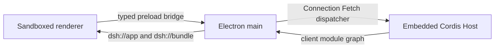

# Cookbook：用 Electron 包装 DSH

[English](wrapping-dsh-with-electron.md) | 中文

本参考文档说明如何把 DSH 作为原生 Electron 应用交付，而不是让 Electron 充当 `dsh web` 子进程的窗口。可运行实现位于 [`apps/desktop`](../../apps/desktop/README.md)；架构决策和被否决的替代方案由 [Electron 内嵌 Host Agent Note](../../.agents/notes/implemented/architecture/2026-08-14-electron-embedded-desktop-host.md) 维护。

## 内嵌 Host，不要监管 Host 进程

Electron main 已经提供 Node 运行时。在 main 中调用 `runProfile({ profile: 'desktop' })`，由 Electron 应用拥有 Host 上下文、原生窗口、单实例锁和关闭顺序。使用 `dsh web` 子进程会增加第二套依赖闭包、回环服务器、就绪协议、进程树监管和故障边界，却不增加隔离性：renderer 仍然需要受限的原生桥接。

交付的 desktop profile 依次叠加 `dsh-base`、`dsh-web-app` 和 `dsh-desktop-app`。它保留共享 Host 与客户端插件图；desktop patch 禁用 HTTP 服务器和仅供浏览器使用的启动条目，为 Connection service 选择 `electron` transport，并安装原生 provider。`runProfile` 暴露 `prepare(ctx)` 承载层接入点，用于安装必须先于 profile 条目挂载的 service；它不是可热重载的配置条目。



## 在应用 origin 下复用 Web renderer

浏览器和桌面端使用同一份 Web 前端构建。在 `app.ready` 前注册 privileged `dsh:` scheme；通过 `dsh://app` 提供 `apps/web/dist`，通过 `dsh://bundle` 提供客户端图授权的 bundle。为 JavaScript module、CSS、字体、图片、manifest 和 JSON 返回明确的 MIME type。通过 `file://` 加载生产 UI 会让 module script 和 CSP 获得 opaque origin，通常只留下空的 `#root`。

Vite 构建使用 `base: './'`，使同一份生产构建可以在 HTTP 和 `dsh://app` 载体下重定位；manifest 和 icon link 也因此使用相对路径。共享文档的 CSP 允许应用自有的 `dsh:` script，但不允许 `unsafe-eval`。因此，vendored Loader 只在 Host 配置插值确实需要时创建 `new Function` evaluator，而不会在浏览器导入 Loader 时创建。

Preload 只暴露类型化的 `ElectronRendererBridge`。在 `AppWebEntry.run()` 前，renderer 等待 `desktop.manifest()`，并把返回的模块图安装到 `window.__DSH_BOOT__`；`AppWebEntry` 在解除 Loader hold 时消费该值。在 manifest 到达前启动客户端会与插件组装竞争，并产生不完整的 UI。

## 通过类型化 IPC 承载 Host 请求

保持启用 `contextIsolation`、renderer sandbox 和 Web security，并禁用 Node integration。不要暴露 `ipcRenderer`、文件系统原语或通用 invoke 方法。当前 bridge 只包含 manifest 查询、Fetch open/read/cancel、session export 保存、原生窗口 chrome 和 supervisor 状态操作。

Electron main 只接受当前 main frame 发往 `http://dsh.internal` 的 Host Fetch 请求。它在调用 Web 承载层使用的同一个 Connection Fetch dispatcher 前，验证 method、header、URL 和 body size。每个请求获得私有 `MessagePort`；main 只发送一次 response metadata，renderer 每次请求一个 body chunk。取消操作会 abort Host 请求。该 pull protocol 限制排队数据量，同时不引入第二套 RPC 模型。

Electron API client 始终在 `http://dsh.internal` 上构造 Host URL。全局 Fetch adapter 还会重写来自 `dsh://app` 的相对 Host 请求或同文档 Host 请求；其他 URL 继续使用 Chromium 原生 Fetch。如果没有该重写，客户端插件调用 `fetch('/api/...')` 时会到达静态 `dsh://app` protocol handler，并收到 404。

## 支持没有 Node internal ESM loader 的运行时

Cordis Loader 通常使用 Node internal ESM loader 导入 package 并执行 module HMR。Electron 不暴露该 internal service。公共 fallback 通过锚定在配置树 `ctx.baseUrl` 的 `createRequire` 解析非相对插件名，再导入解析结果。该锚点不可省略：profile 安装的 package 必须优先于应用 package；改用 `import(name)` 会从 Loader package 而不是配置所有者处解析。

配置监听和 module hot reload 的要求不同。显式创建且 `root: []` 的 HMR 实例只通过文件系统监听 `cordis.patch.yml`，不依赖 Node internal。非空 module root 仍然需要 internal loader；缺失时在启动阶段失败。把 profile 目录作为 HMR `base` 传入；否则进程级 `chdir()` 会移动被监听路径。

浏览器构建把 Loader fallback 的 `node:module`、`node:path` 和 `node:url` import alias 到浏览器 stub。客户端模块系统注入 `loader.internal` 后不会到达这些 stub；stub 会直接失败，或只实现构建所需的解析行为。删除这些 alias 会让 Vite externalize Node builtin，并导致生产构建失败。

## 打包闭合的应用依赖图

`electron-builder` 跟随 `dependencies`，不会跟随 workspace `peerDependencies`。因此 desktop package manifest 声明 `runProfile` 可能加载的完整 workspace peer closure；CI 在打包前针对该 manifest 运行 `verify-runtime-closure`。源代码 checkout 会掩盖缺失声明，因为 pnpm workspace link 仍可提供 package；只有 packaged smoke 才会暴露遗漏。

Electron 的 asar overlay 还有一项约束：当解析已经进入 `app.asar` 时可以访问其中路径，但从外部 `$DSH_HOME/profiles/node_modules` 指向 archive 内部的 symlink 对 `existsSync` 和 `require.resolve` 表现为不存在。在 `app.ready` 后，main 把 `join(app.getAppPath(), 'node_modules')` 加到 `NODE_PATH` 前端，并调用 `Module._initPaths()`。`createRequire` 仍从 profile 目录开始，因此 profile-local package 和普通 parent walk 保持优先；应用依赖图只是最终 fallback。不要把 Loader `baseUrl` 移到 asar，不要 unpack 整个 JavaScript 依赖图，也不要把应用 package 复制到 `$DSH_HOME`。

在 main 和 preload 构建中保持 npm `electron` package external。把 Electron 的 CommonJS launcher bundle 到 ESM main 中，可能会在应用内执行它的 binary-download wrapper，并在 `app.whenReady()` 前失败。两个入口的 `tsdown` 都使用 `deps.neverBundle: ['electron']`。

在 Windows 上，Electron 中的 `process.execPath` 指向应用可执行文件。Windows ACL runner 仍是普通 JavaScript runner；sandbox provider 只通过 `ConfinedArgv.environment` 为该受限 child 附加 `ELECTRON_RUN_AS_NODE=1`。Bash 和 PowerShell sandbox consumer 必须在 caller 与 DSH 值之后叠加 runner 要求的 environment。如果为整个应用设置该变量，desktop process 自身会切换到 Node mode。

## 同步 upstream 时需要保留的核心修改

Electron 应用的大部分实现都是新增代码，但以下既有 DSH surface 承载集成不变量。同步 upstream 时应保留其原因；JSON 和 TSConfig 文件无法添加注释，因此由本表记录其修改理由。

| 既有 surface | 必须保留的行为 | 丢失后的回归 |
|---|---|---|
| `apps/cli/src/profile-boot.ts`; `apps/cli/package.json`; `apps/cli/tsconfig.json` | 导出 `runProfile`，在 profile 条目前运行承载层 `prepare`，以 profile base 挂载仅监听配置的 HMR，并保留 desktop bundle project reference 与独立构建、导出的 entry。 | Electron 无法在 consumer 前安装原生 provider、用户 patch 监听相对于进程 cwd 解析，或 packaged entry 丢失 compiler dependency。 |
| `packages/boot/app-boot/src/profile.ts` | 以 base + Web 客户端条目 + desktop patch 的组合交付 `desktop` template。 | 全新的 `$DSH_HOME` 无法初始化 desktop profile。 |
| `apps/web/index.html`; `apps/web/src/main.ts`; `apps/web/vite.config.ts`; `apps/web/src/node-module-stub.ts`; `apps/web/package.json`; `apps/web/tsconfig.json` | 保留可重定位的生产资源、严格 CSP、preload manifest 注入、Loader builtin alias、client-connection dependency、desktop e2e Host program 和 Connection client compiler reference。 | 同一份 frontend build 无法服务两种载体、Vite 因 Node builtin 失败、客户端依赖图与 manifest 竞争，或静态 program 漏掉 renderer/desktop 集成。 |
| `packages/client/connection` source、manifest 和 compiler face | 保留 `web | electron` 物理承载层区分、共享 Fetch dispatcher、类型化 bridge export、URL rewrite、pull-stream 实现，以及 client/Host compiler entry。 | Electron 回退到 HTTP/WebSocket、载体信任规则退化为 Web `trustedHosts`，或发布文件漏掉 bridge 代码。 |
| `vendor/loader/src/config/tree.ts`; `vendor/loader/src/config/utils.ts` | 保留以配置为锚点的公共解析和 lazy JavaScript evaluator 创建逻辑。vendor sync 后重新应用 [`vendor/README.md`](../../vendor/README.md) 中对应的修改记录。 | 已打包插件从错误所有者处解析，或 CSP 在 module import 阶段阻止 renderer。 |
| `vendor/hmr/src/index.ts` | 保持仅监听配置的 `root: []` 不依赖 module-loader internal；保留对非空 module root 的检查。sync 后重新应用 local-modification log 条目。 | Electron boot 因 `--expose-internals` 失败，或 module HMR 在缺少所需 cache data 时运行。 |
| `packages/sandbox/sandbox`、`packages/sandbox/sandbox-local`、`packages/shell/*-local`、`packages/shell/*-sandbox` | 保留 `ConfinedArgv.environment`，并把它分层传递到 foreground 和 background spawn。 | Windows 在 Node mode 下运行 ACL runner 时启动 Electron GUI。 |
| `packages/client/modules/src/index.ts` | 保持客户端依赖图组合不依赖可选的 Web 发布；Electron 通过 `dsh://bundle` 读取 `graph()` 和 `clientPath()`。 | 禁用 `webServer` 后 registry 一直 pending，或 renderer boot manifest 所需的依赖图消失。 |
| `packages/client/ui-layout`、`packages/client/ui-sidebar`、`packages/session-query/session-log-export` | 保留 macOS hidden-inset 拖动区域和 traffic-light 间距，以及由 preload 持有的 session export 原生保存路径。 | 无边框窗口无法拖动、chrome 遮挡 sidebar，或 `dsh://app` export 没有结果。 |
| `packages/fs/tool-fs-search/src/search-core.ts` | 保持 `DSH_RIPGREP_PATH` 是经过验证的可选 deployment override，而不是 Electron boot 的必需路径；当前 desktop package 通过 `asarUnpack` 暴露 ripgrep。 | 不可用的 override 被静默回退，或未来打包把未使用的 override 误认为当前 binary path。 |
| 根 `package.json`、`pnpm-workspace.yaml`、`tsconfig.host.json` 和支持 desktop 的 `scripts/*` | 保留 desktop dev entry、private build-only 排除项、Electron install policy、compiler coverage、release cleanup、dependency-closure scan 和生成 catalog 的输入。 | Desktop 被意外发布到 npm、从静态 gate 中遗漏，或根据 stale、未验证的依赖图打包。 |
| `apps/desktop/package.json`; `.github/workflows/desktop.yml` | 保留闭合 dependency list、Electron externalization、asar resource、native artifact matrix 和 runtime-closure gate。 | 源代码运行正常，但 packaged startup 报告缺少插件，或 platform artifact 漏掉必需文件。 |

## 按层诊断故障

| 现象 | 首先检查的契约 |
|---|---|
| 窗口打开，但 `#root` 为空 | `dsh://app` MIME type、Vite relative base、CSP 和 eager `new Function` 创建。 |
| `dsh://app` 下的客户端记录 `/api` 404 | Electron Host URL 固定和同文档 Fetch rewrite。 |
| Boot 报告 `--expose-internals` | fallback HMR 实例必须使用 `root: []`；没有 Node internal 时不支持 module root。 |
| Packaged boot 从 profile path 报告 `ERR_MODULE_NOT_FOUND` | Desktop dependency closure、`NODE_PATH` 初始化和 Loader 的 `ctx.baseUrl` 锚点。 |
| Main 记录 Electron binary downloader 或 `__dirname` 错误 | `electron` dependency 被 bundle 到 ESM main。 |
| Windows 为 sandbox command 打开另一个应用窗口 | `ELECTRON_RUN_AS_NODE=1` 没有传递给受限 runner child。 |

## 验证真实承载层

构建 Host、Web 前端和 desktop entry 后，运行源代码 Electron e2e：

```sh
pnpm exec vitest run --config vitest.web.config.ts apps/web/tests/desktop-profile.e2e.ts
```

该测试启动真实 Electron binary，等待共享 UI，比较 accessibility transcript，关闭原生窗口，并要求进程以零状态退出。Unit test 分别固定 IPC validation、protocol path/MIME handling、Fetch streaming/cancellation、profile precedence 和 `NODE_PATH` fallback。

源代码 e2e 不能证明 asar packaging。用原生 runner 构建 unpacked application，以全新的 `DSH_HOME` 和 user-data 目录启动，确认 1280×800 main window 进入 Standard mode，再通过应用 lifecycle 关闭：

```sh
pnpm --dir apps/desktop run pack
```

生成发布 artifact 前，运行 runtime-closure gate 和对应 target 的 artifact verifier。macOS、Linux 和 Windows package 必须在匹配的原生 runner 上构建；未签名的 macOS 输出适用于本地 smoke test，但不能作为已签名分发的声明。
